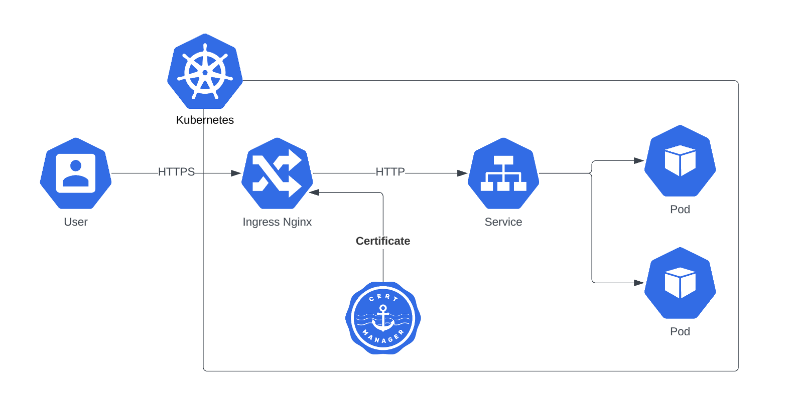

By default, requests to services will go to ingress-nginx service first and ingress-nginx will terminate the ssl and it will send http traffic to the backend service.



While some people consider this architecture secure enough, some users prefer to secure the communication between ingress-nginx and pods as well. In this tutorial you will learn how to do it.

The certificate kuberise.io generated before for your service, is terminated in ingress-nginx server and is for incoming traffic from outside the cluster. For backend https traffic, we need to generate another certificate and force ingress-nginx to send https traffic to the backend pods.

## Assumptions
- You have deployed kuberise.io in your kubernetes cluster.
- You have already added your tool and service into your kuberise.io platform and it has https certificate and ingress. But the backend traffic from ingress-nginx to the pod is http and it is not encrypted.

In summary:

1. Make a chart in templates folder for your service
2. Add a cert-manager certificate object to the templates folder of your chart
3. Mount the secret that contains the certificate into your container
4. Change the service port of your service to 443 or any defined number and add necessary annotations to your ingress object

Now let's go to the details of each step. Assume that I would like to add a service called keycloak and I want to send https traffic from ingress-nginx to keycloak:

## 1. Make a chart in templates folder:

To add a service to kuberise.io there are two ways: Add the external chart repository address to the app-of-apps values file and install it directly or add a chart in templates folder and make the service a dependency to that chart. In situations that we need to add more yaml templates to our service, the second approach is better.

So I create folder in templates called keycloak and I make a chart inside this folder. The simplest chart should have a templates folder and a Chart.yaml and a values.yaml file.

```sh
kuberise
.
├── app-of-apps
│   ├── Chart.yaml
│   ├── templates
│   ├── values-local-example.yaml
│   └── values.yaml
├── templates
│   └── keycloak
│       ├── templates
│       ├── Chart.yaml
│       └── values.yaml
└── values
    ├── defaults
    └── local-example
```


The Chart.yaml contains the definition of the chart and in this file I add the actual keycloak helm chart as a dependency:

```yaml
apiVersion: v2
name: keycloak
version: 1.0.0
dependencies:
  - name: keycloakx
    version: 2.3.0
    repository: https://codecentric.github.io/helm-charts
```

The actual helm chart name in codecentric repository is keycloakx. I put it as dependency. But in kuberise.io I would like to name it as keycloak. Pay attention that because keycloakx is a dependency of keycloak chart, values related to keycloakx should be under keycloakx: and not in the root of values file.

## 2. Add a cert-manager certificate object to the templates folder of your chart

Inside `templates/keycloak/templates` folder I add a cert-manager certificate template to ask cert-manager to create a certificate for keycloak service with internal dns address:

```yaml
# templates/keycloak/templates/keycloak-certificate.yaml
{{- if .Values.selfSignedCertificate }}
apiVersion: cert-manager.io/v1
kind: Certificate
metadata:
  name: keycloak-certificate
  namespace: keycloak
spec:
  secretName: keycloak-tls-secret
  duration: 2400h
  renewBefore: 100h
  dnsNames:
  - keycloak-keycloakx-http.keycloak.svc.cluster.local
  issuerRef:
    name: selfsigned-clusterissuer
    kind: ClusterIssuer
---
{{- end }}
```

and I add selfSignedCertificate to the values.yaml
```yaml
# templates/keycloak/values.yaml
selfSignedCertificate: false
```

Then make this variable true in the `values/local-example/platform/keycloak/values.yaml` file:

```yaml
# values/local-example/platform/keycloak/values.yaml
selfSignedCertificate: true
```

## 3. Mount the secret that contains the certificate into your container
For keycloak instead of deployment it is statefulset. But it doesn't matter and I need to create an extra volume from the secret containing the certificate, and mount it to the keylcloak container in a proper location.

```yaml
# templates/keycloak/values.yaml
selfSignedCertificate: false

keycloakx:
  postgresql:
    enabled: false
  extraVolumes: |
    - name: keycloak-tls-volume
      secret:
        secretName: keycloak-tls-secret
  extraVolumeMounts: |
    - name: keycloak-tls-volume
      mountPath: "/etc/x509/https"
      readOnly: true
```

## 4. Change the service port of your service to 443 or any defined number and add necessary annotations to your ingress object
Now in my ingress, I have to change the service port number. In keycloakx I can see the helm default values file that the https port is 8443. so in `values/local-example/platform/ingresses/values.yaml` I change the keycloak port to 8443. Also I need to add some annotations to make ingress-nginx to send https to the backend:

```yaml
# values/local-example/platform/ingresses/values.yaml
  - name: keycloak
    serviceName: keycloak-keycloakx-http
    port: 8443
    annotations:
      nginx.ingress.kubernetes.io/app-root: /auth/
      nginx.ingress.kubernetes.io/backend-protocol: "HTTPS"
      nginx.ingress.kubernetes.io/auth-tls-secret: "cert-manager/ca-key-pair-external"
```
